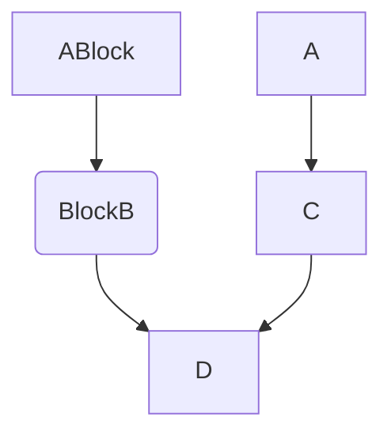
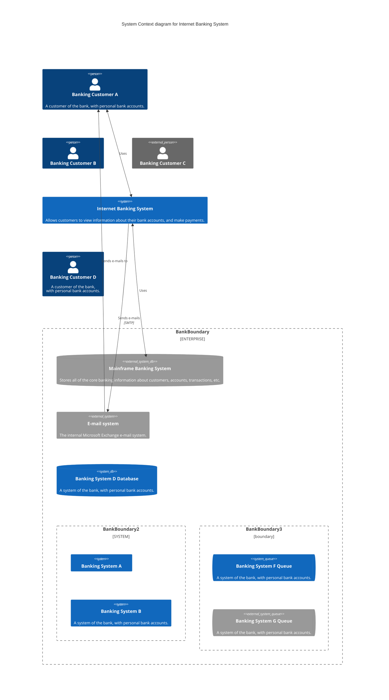

### Hi there, My name is.👋
<kbd>K</kbd><kbd>E</kbd><kbd>V</kbd><kbd>I</kbd><kbd>N</kbd>

```javascript

console.log("Welcome to the Machine");

```


<details><summary>Tasks</summary>
<P>

**bawtman/bawtman** is a ✨ _special_ ✨ repository because its `README.md` (this file) appears on your GitHub profile.

Here are some ideas to get you started:

- 🔭 I’m currently working on: Blockchain, Ethereum, smart contracts ect...
- 🌱 I’m currently learning: Solidity
- 👯 I’m looking to collaborate on: Any projects based in solidity, Web3, Blockchain.
- 🤔 I’m looking for help with: I got this!
- 💬 Ask me about: Anything
- 📫 How to reach me: [Email](mailto:bawtman@yahoo.com)
- ⚡ Fun fact: ...

</P>
</details>

<details><summary>Table</summary>
<P>

| First Header  | Second Header | First Header  |
| :------------ | :-----------: | ------------: |
| Content Cell  | Content Cell  | Content Cell  |
| Content Cell  | Content Cell  | Content Cell  |
| Content Cell  | Content Cell  | Content Cell  |
| Content Cell  | Content Cell  | Content Cell  |
| Content Cell  | Content Cell  | Content Cell  |

</P>
</details>

<details><summary>A little fun</summary>
<p>

#### We can hide anything, even code!

```stl
solid cube_corner
  facet normal 0.0 -1.0 0.0
    outer loop
      vertex 0.0 0.0 0.0
      vertex 1.0 0.0 0.0
      vertex 0.0 0.0 1.0
    endloop
  endfacet
  facet normal 0.0 0.0 -1.0
    outer loop
      vertex 0.0 0.0 0.0
      vertex 0.0 1.0 0.0
      vertex 1.0 0.0 0.0
    endloop
  endfacet
  facet normal -1.0 0.0 0.0
    outer loop
      vertex 0.0 0.0 0.0
      vertex 0.0 0.0 1.0
      vertex 0.0 1.0 0.0
    endloop
  endfacet
  facet normal 0.577 0.577 0.577
    outer loop
      vertex 1.0 0.0 0.0
      vertex 0.0 1.0 0.0
      vertex 0.0 0.0 1.0
    endloop
  endfacet
endsolid
```


</p>
</details>



