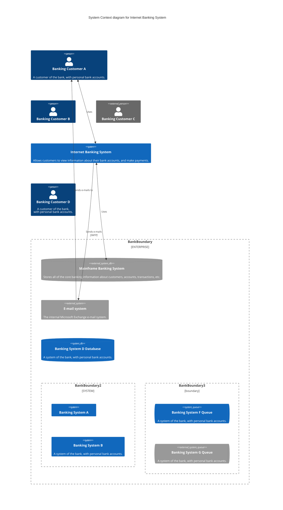

### Hi there, My name is.👋
<kbd>K</kbd><kbd>E</kbd><kbd>V</kbd><kbd>I</kbd><kbd>N</kbd>

```javascript

console.log("Welcome to the Machine");

```
https://bawtman.github.io/intro/
https://buymeacoffee-solidity-defi-tipping-app.bawtman.repl.co/


<details><summary>Tasks</summary>
<P>

- 🔭 I’m currently working on: Blockchain, Ethereum, smart contracts ect...
- 🌱 I’m currently learning: Solidity
- 👯 I’m looking to collaborate on: Any projects based in solidity, Web3, Blockchain.
- 🤔 I’m looking for help with: I got this!
- 💬 Ask me about: Anything
- 📫 How to reach me: [Email](mailto:bawtman@yahoo.com)
- ⚡ Fun fact: ...

</P>
</details>

<details><summary>Skills and Thrills</summary>
<P>

|   Blockchain  |     Coding    |      Tools    |
| :-----------: | :-----------: |  :----------: |
|   |   |    |
|  |   |   |
|   |  |  |
|   |  |  |
|  |   |  |
| Content Cell  | Content Cell  | Content Cell  |

</P>
</details>


<details><summary>a</summary><P>⚡ Fun fact:</P></details>


<details><summary>A little fun</summary>
<p>

#### We can hide anything, even code!


```stl
solid MYSOLID
  facet normal  0.0   0.0  -1.0    
    outer loop
      vertex    0.0   0.0   0.0    
      vertex    1.0   1.0   0.0    
      vertex    1.0   0.0   0.0    
    endloop
  endfacet
  facet normal  0.0   0.0  -1.0    
    outer loop
      vertex    0.0   0.0   0.0 
      vertex    0.0   1.0   0.0    
      vertex    1.0   1.0   0.0    
    endloop
  endfacet
  facet normal -1.0   0.0   0.0    
    outer loop
      vertex    0.0   0.0   0.0
      vertex    0.0   1.0   1.0
      vertex    0.0   1.0   0.0
    endloop
  endfacet
  facet normal -1.0   0.0   0.0    
    outer loop
      vertex    0.0   0.0   0.0
      vertex    0.0   0.0   1.0
      vertex    0.0   1.0   1.0
    endloop
  endfacet
  facet normal  0.0   1.0   0.0    
    outer loop
      vertex    0.0   1.0   0.0
      vertex    1.0   1.0   1.0
      vertex    1.0   1.0   0.0
    endloop
  endfacet
  facet normal  0.0   1.0   0.0    
    outer loop
      vertex    0.0   1.0   0.0
      vertex    0.0   1.0   1.0
      vertex    1.0   1.0   1.0
    endloop
  endfacet
  facet normal  1.0   0.0   0.0    
    outer loop
      vertex    1.0   0.0   0.0
      vertex    1.0   1.0   0.0
      vertex    1.0   1.0   1.0
    endloop
  endfacet
  facet normal  1.0   0.0   0.0    
    outer loop
      vertex    1.0   0.0   0.0
      vertex    1.0   1.0   1.0
      vertex    1.0   0.0   1.0
    endloop
  endfacet
  facet normal  0.0  -1.0   0.0    
    outer loop
      vertex    0.0   0.0   0.0
      vertex    1.0   0.0   0.0
      vertex    1.0   0.0   1.0
    endloop
  endfacet
  facet normal  0.0  -1.0   0.0    
    outer loop
      vertex    0.0   0.0   0.0
      vertex    1.0   0.0   1.0
      vertex    0.0   0.0   1.0
    endloop
  endfacet
  facet normal  0.0   0.0   1.0    
    outer loop
      vertex    0.0   0.0   1.0
      vertex    1.0   0.0   1.0
      vertex    1.0   1.0   1.0
    endloop
  endfacet
  facet normal  0.0   0.0   1.0    
    outer loop
      vertex    0.0   0.0   1.0
      vertex    1.0   1.0   1.0
      vertex    0.0   1.0   1.0
    endloop
  endfacet
endsolid MYSOLID

```


</p>
</details>




